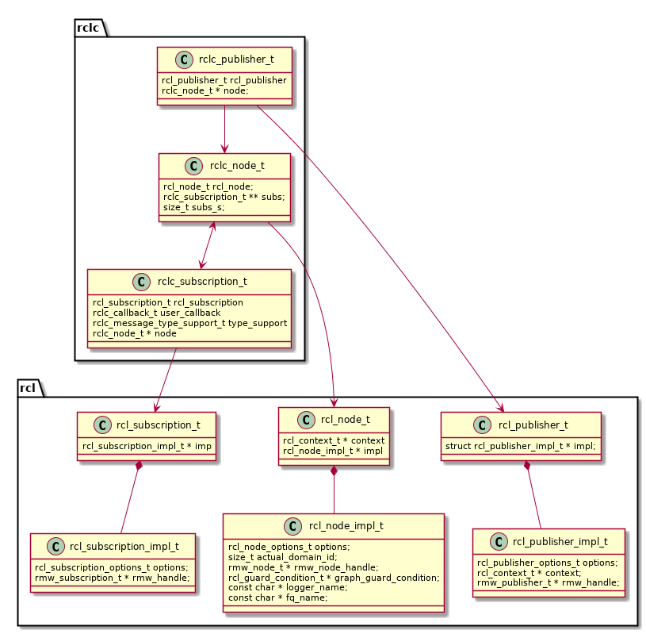

General information about this repository, including legal information, build instructions and known issues/limitations, are given in [README.md](../README.md) in the repository root.

# The rclc package

This package provides a lightweight ROS 2 Client Library for the C language.

## Architecture

